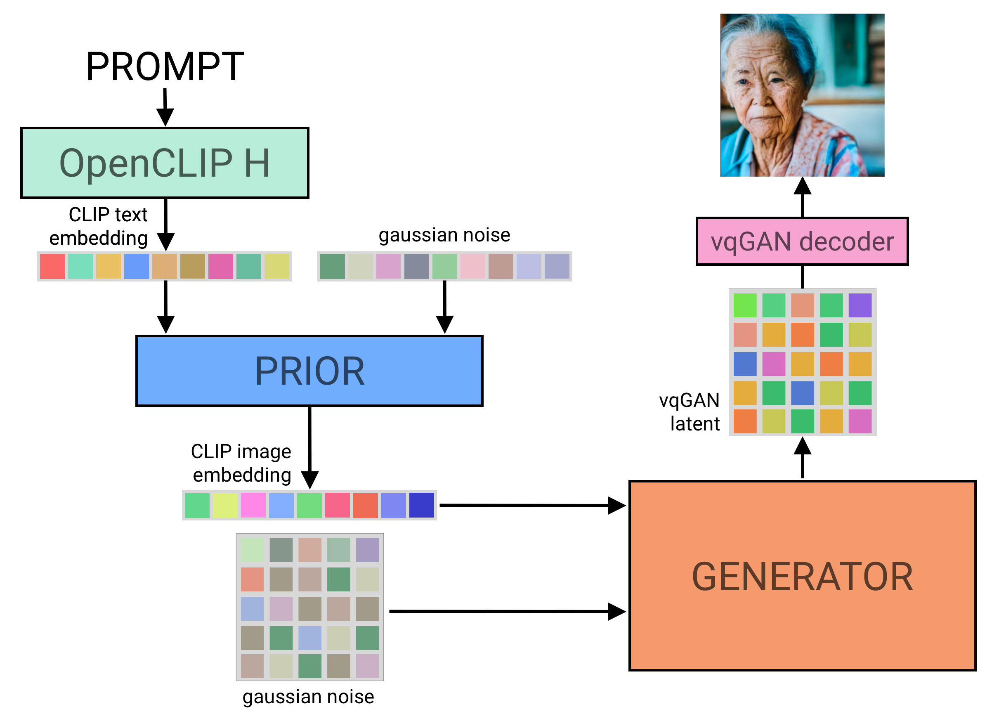

[](https://colab.research.google.com/drive/1LLMH3RdhCNjFdN4SBDmY2ozMvp5nnR0U?usp=sharing)

# Arroz Con Cosas
The name of this repository is Spanish for 'rice with things'. This is how people from Valencia call anything that's not the "original Valencian Paella". 
Since this repository uses some of the core elements of [Paella](https://github.com/dome272/Paella/blob/main/modules.py)'s architecture, but is also not fully Paella, the name Arroz Con Cosas was a perfect fit.


## Motivation
With this repository, our goal is not to build a new SOTA model, but instead to showcase a simple and easy to read model/architecture & small training code to allow anyone to train/finetune/tweak their custom Latent Diffusion Model with minimal effort. 



You'll find 2 distinct models here: a **clip2img** model that will turn a CLIP image embedding into an image, and a **prior** that will turn an CLIP text embedding into a CLIP image embedding. The main reason for this is to provide flexibility when finetuning, maybe you want to train your own image generator and use only our prior, or maybe you want to use our generator, but create your own prior that generates CLIP image embeddings from another input, like audio, or EEG signals! 

Feel free to use all of the code provided in this repository, or part of it (generator, vqgan or prior) for your personal experiments.

```
# You can install this as a pip module by runninn the following
# but you'll still need to download the model checkpoints manually

pip install git+https://github.com/pabloppp/Arroz-Con-Cosas -U

```

**/!\ Keep in mind that this is a WIP and things might not work perfectly all the time. We'll try to keep updating the code & checkpoints.**


## CLIP2Img v1

The latest clip2img checkpoint, trained for 500K batches of 128 images with resolution 512x512 (on LAION-5B clean) is available to [download  here](https://drive.google.com/file/d/16ZJ3ZVbMYe_GpxIAIfhx1AA66n60QLYM/view?usp=sharing)

The vqGAN checkpoint is [available here](https://drive.google.com/file/d/1G3CR0uZ7NdmE4Zj7oxg50KPwuZcq-wzB/view?usp=share_link)

**Other checkpoints:**   
288K batches of 128 images with resolution 512x512 (on LAION-5B clean) is available to [download  here](https://drive.google.com/file/d/1-9Hm3n-I6H1ekKsF-_hGtQInXXPZGd3o/view?usp=share_link)

If you want to resume the training, the raw checkpoints (including optimizer, ema/base models, etc) are [available here](https://drive.google.com/drive/folders/18-3pXyszuZrRmvYvxXB3jjIDalZwTFni?usp=share_link)

### Architecture

The model's architecture used here is same as [Paella](https://github.com/dome272/Paella/blob/main/modules.py) with very minor changes to the inputs & outputs shape so it works directly with latents instead of tokens.

The vqGAN though is custom, and currently only trained on a very small dataset of 7K watercolor images so it's probably a limitation of this model, but it still shows great reconstruction capabilities in any type of picture, with some minor tendency to make watercolor textures.

### Training

The model is trained with a latent diffusion objective:  
The images are encoded into latents using the vqGAN, then gaussian noise is added to it, and the model learns to predict the added noise using a conditioning embedding, in this case a CLIP image embedding.

The [diffusion code](arroz/diffusion.py) to add/remove the gausian noise is a custom, extremely simplified, implementation that works on continuous timesteps (so t is a value between 0 and 1 instead of a discrete step number). It reduces a lot of the complexity of many of the current available diffusion implementations to hopefully make it a bit more accessible.

All the code for training the clip2img model is [available here](scripts/train_v1.py)

<hr>

## OpenCLIP H Prior v1

The latest prior checkpoint, trained for 772K batches of 512 images with resolution 512x512 (on LAION-5B clean) is available to [download here](https://drive.google.com/file/d/1--b6uAM8P4f8IuQ806ypo4D2tutXDwUz/view?usp=share_link)

**Other checkpoints:**   
Trained for 352K batches of 512 images with resolution 512x512 (on LAION-5B clean) is available to [download here](https://drive.google.com/file/d/1-BEpLF9XCh9CE80rvtXdsSdu5YO9FQan/view?usp=share_link)

If you want to resume the training, the raw checkpoints (including optimizer, ema/base models, etc) are [available here](https://drive.google.com/drive/folders/18-3pXyszuZrRmvYvxXB3jjIDalZwTFni?usp=share_link)

### Architecture

This prior uses a very naive and simple architecture, since it's just a sequence of 48 residual linear blocks.

At the beginning of each block, the CLIP text embedding is concatenated in order to condition the model. 

### Training

The training of this prior is effectively identical to the training of the clip2img model, meaning that we learn to predict the added gaussian noise, with the difference that instead of using the vqGAN to encode the image, we use OpenCLIP to generate the image embedding, add noise to it and learn to denoise it conditioning on the text embedding.

All the code for training the prior model is [available here](scripts/train_prior_v1.py)

<hr>

## Sampling

We will try to keep adding more references as we improve the models, for example for image variations (which is pretty straightforward with our generator), DDIM inversion for style transfer, and model finetunings like super resolution, or any other thing that we can come up with.


As of today, we provide a [simple notebook for tex2img ](example_text2img.ipynb) showing how to sample from the prior and the generator.

## License
The model code and weights are released under the [MIT license](LICENSE).
